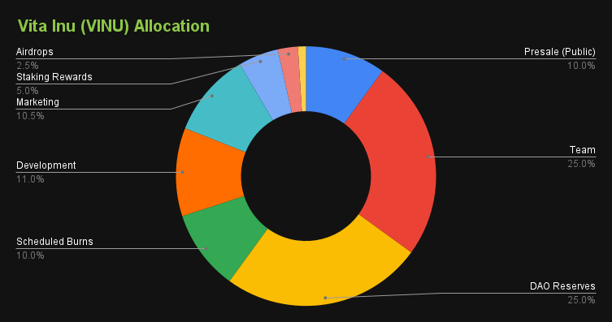

# Tokenomics


**100% Circulating Supply**: As of 2024, all supply of VINU is now in circulation.&#x20;

The Distribution Plan has been completed.



VINU (BEP20): [0xfebe8c1ed424dbf688551d4e2267e7a53698f0aa](https://bscscan.com/token/0xfebe8c1ed424dbf688551d4e2267e7a53698f0aa)



**No Mint**: VINU cannot be minted. Supply can only decrease.



**Renounced Contract**: The token contract ownership is renounced.


<figure><figcaption></figcaption></figure>

<figure><figcaption></figcaption></figure>

The total supply of VINU at inception is 1 quadrillion (1,000,000,000,000,000). No more than this amount will ever exist. This means that there will be no inflation of VINU.

#### The initial distribution of Vita Inu (VINU) tokens was as follows:

* 10.00% is allocated to Presale
* 25.00% is allocated to Team
* 25.00% is allocated to DAO Reserves
* 10.00% is allocated to Scheduled Burns
* 11.00% is allocated to Development
* 10.50% is allocated to Marketing
* 5.00% is allocated to Staking Rewards
* 2.50% is allocated to Airdrops
* 1.00% is allocated to Voter Rewards
